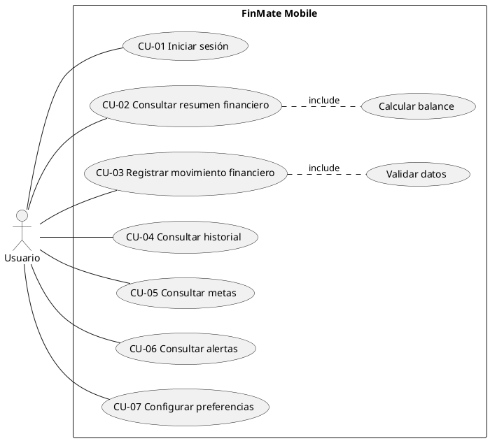

# Diagrama UML de casos de uso

## Descripción

El actor principal es el Usuario. El sistema FinMate Mobile agrupa los casos de uso principales de la aplicación. El caso Registrar movimiento financiero incluye la validación de datos, mientras que Consultar resumen financiero incluye el cálculo del balance.
