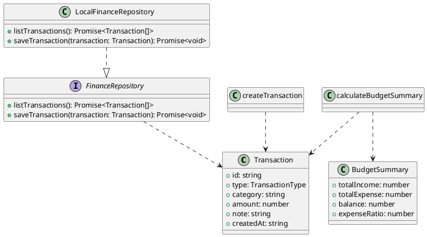

# Diagrama UML de clases - Dominio FinMate Mobile

## Descripción

El diagrama separa entidades, contrato de repositorio, implementación local y casos de uso. Esta organización responde a una arquitectura por capas y facilita mantenimiento, validación y evolución del proyecto.
