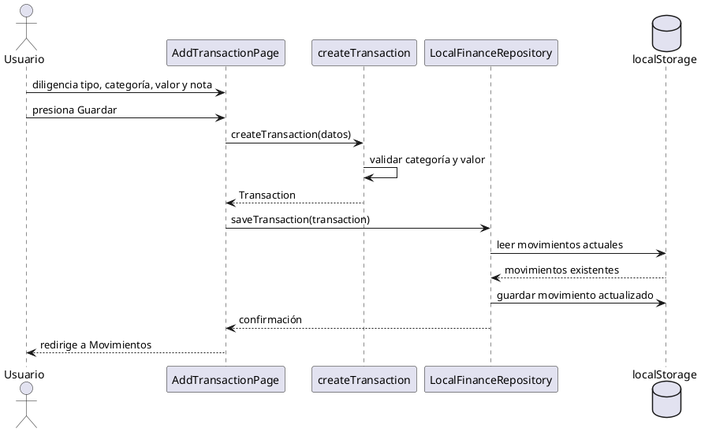

# Diagrama UML de secuencia - Registrar movimiento financiero

## Descripción

El flujo inicia cuando el usuario diligencia el formulario de nuevo movimiento. La pantalla valida la información mediante el caso de uso `createTransaction` y luego delega la persistencia al repositorio local. El repositorio actualiza el almacenamiento local y la interfaz redirige al historial de movimientos.
